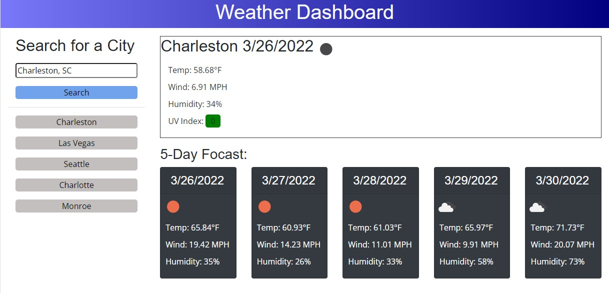

# Work Day Scheduler Starter Code
Interactive workday calendar.  Allows add and removing tasks for each hour of the workday.  Color codes the task description content holders with respect to the current hour of the day as grey for past, red for present or green future.

## Repository
[GitHub](https://github.com/ladytrell/travel-weather/)

## Active Site
[Hosted on GitHub ](https://ladytrell.github.io/travel-weather/)

## Preview Image
